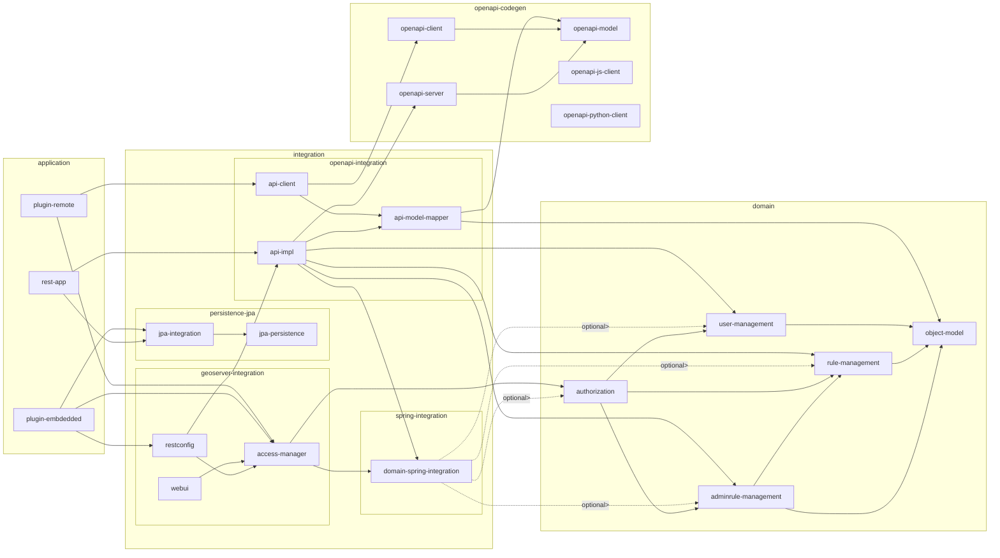

## Dependency graph

```mermaid
flowchart LR
  subgraph domain
    adminrule-management --> object-model & rule-management
    authorization --> adminrule-management & user-management & rule-management
    rule-management --> object-model
    user-management --> object-model
  end
  subgraph openapi-codegen
    openapi-server --> openapi-model
    openapi-client --> openapi-model
    openapi-js-client
    openapi-python-client
  end
  subgraph integration
    subgraph persistence-jpa
        jpa-integration --> jpa-persistence
    end
    subgraph spring-integration
        domain-spring-integration -. optional> .-> rule-management & adminrule-management & user-management & authorization
    end
    subgraph openapi-integration
        api-model-mapper --> object-model & openapi-model
        api-impl --> api-model-mapper & openapi-server & domain-spring-integration & rule-management & adminrule-management & user-management
        api-client --> api-model-mapper & openapi-client
    end
    subgraph geoserver-integration
        access-manager --> 
          domain-spring-integration & authorization
        restconfig --> api-impl & access-manager
        webui --> access-manager
    end
  end
  subgraph application
    rest-app --> api-impl & jpa-integration
    plugin-embdedded --> jpa-integration & access-manager & restconfig
    plugin-remote --> api-client & access-manager
  end
```