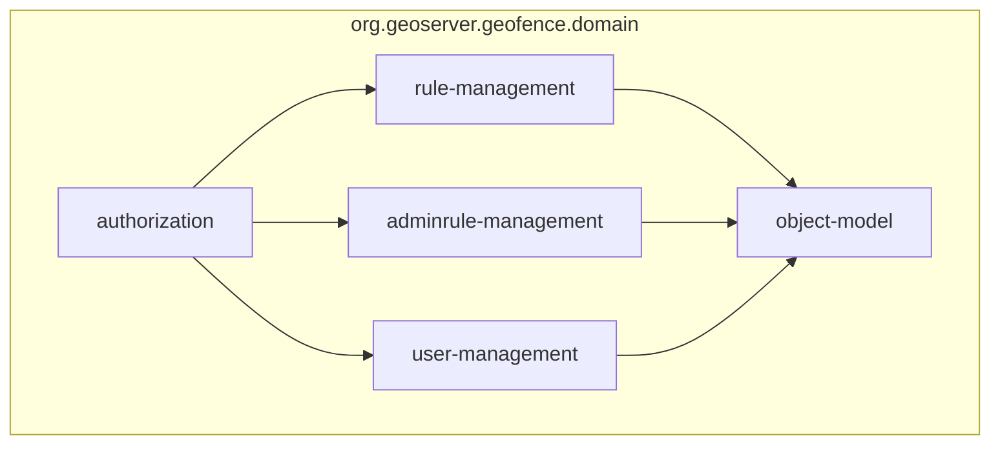
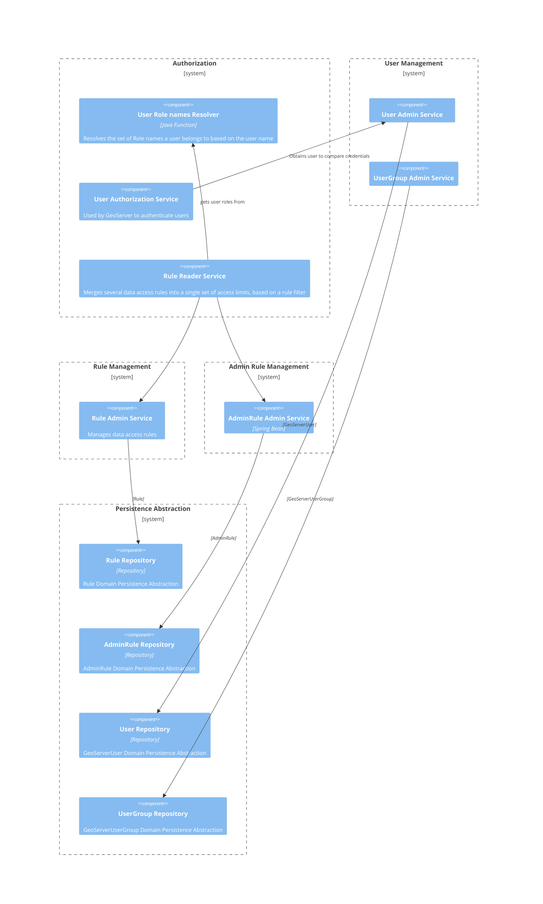

# GeoFence Domain Business Model

## Dependency graph

```mermaid
flowchart LR
  subgraph org.geoserver.geofence.domain
    direction LR
    rule-management --> object-model
    adminrule-management --> object-model
    user-management --> object-model
    authorization --> rule-management & adminrule-management & user-management
  end
```

## Component diagram

```mermaid
C4Context
  Boundary(authb, "Authorization") {
    Component(rolesResolver, "User Role names Resolver", "Java Function", "Resolves the set of Role names a user belongs to based on the user name")      
    Component(auth, "User Authorization Service", "", "Used by GeoServer to authenticate users")
    Component(ruleAcces, "Rule Reader Service", "", "Merges several data access rules into a single set of access limits, based on a rule filter",)
    
    Rel_R(auth, user, "Obtains user to compare credentials")
    Rel_R(ruleAcces, adminRule, "")
    Rel_R(ruleAcces, rule, "")
    Rel_R(ruleAcces, rolesResolver, "gets user roles from")
  }
  Boundary(umb, "User Management") {
    Component(user, "User Admin Service", "", "")
    Rel_R(user, userRepo, "", "GeoServerUser")
    
    Component(group, "UserGroup Admin Service", "", "")      
    Rel_R(group, groupRepo, "", "GeoServerUserGroup")
  }
  Boundary(rmb, "Rule Management") {
    Component(rule, "Rule Admin Service", "", "Manages data access rules")      
    Rel_R(rule, ruleRepo, "", "Rule")
  }
  Boundary(armb, "Admin Rule Management") {
    Component(adminRule, "AdminRule Admin Service", "Spring Bean")
    Rel_R(adminRule, adminRuleRepo, "", "AdminRule")
  }
  Boundary(repos, "Persistence Abstraction") {
    Component(ruleRepo, "Rule Repository", "Repository", "Rule Domain Persistence Abstraction")
    Component(adminRuleRepo, "AdminRule Repository", "Repository", "AdminRule Domain Persistence Abstraction")
    Component(userRepo, "User Repository", "Repository", "GeoServerUser Domain Persistence Abstraction")
    Component(groupRepo, "UserGroup Repository", "", "GeoServerUserGroup Domain Persistence Abstraction")
  }
```
